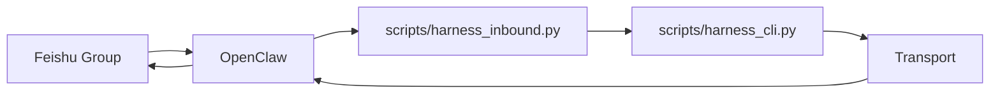

# OpenClaw And Feishu

OpenClaw and Feishu are optional integration layers. The public repository does
not require either one for the first smoke test.

## Default Behavior

The generated local config starts with:

- `transport.type = "noop"`
- `transport.channel = "none"`

That keeps the first-run experience local and side-effect free.

## Enabling OpenClaw Outbound

Set these fields in `config/local/runtime.json`:

- `transport.type = "openclaw"`
- `transport.channel = "feishu"`
- `openclaw.plugin_path`
- `openclaw.workspace_root`
- `feishu.group_map`

The transport implementation shells out through the local OpenClaw CLI. It does
not install plugins or repair the gateway for you.

## Enabling Direct Feishu API

Set these fields in `config/local/runtime.json`:

- `transport.type = "direct_feishu"`
- `transport.channel = "feishu"`
- `feishu.group_map`

Set these values in `config/local/.env`:

- `FEISHU_APP_ID`
- `FEISHU_APP_SECRET`

## Inbound Command Routing

Inbound routing is handled by:

```bash
python3.11 -m scripts.harness_inbound --message-text "/harness backup" --project-root . --execute
```

The inbound hook:

- extracts `/harness ...` or `harness ...`
- parses the command into CLI argv
- optionally executes the unified Harness CLI

## Closed-Loop Shape



## Recommended Rollout

1. Pass the noop smoke test first.
2. Validate OpenClaw health locally.
3. Fill `feishu.group_map` in `config/local/runtime.json`.
4. Run a dry-run outbound test.
5. Run a live smoke test only after the public repository is otherwise ready.
